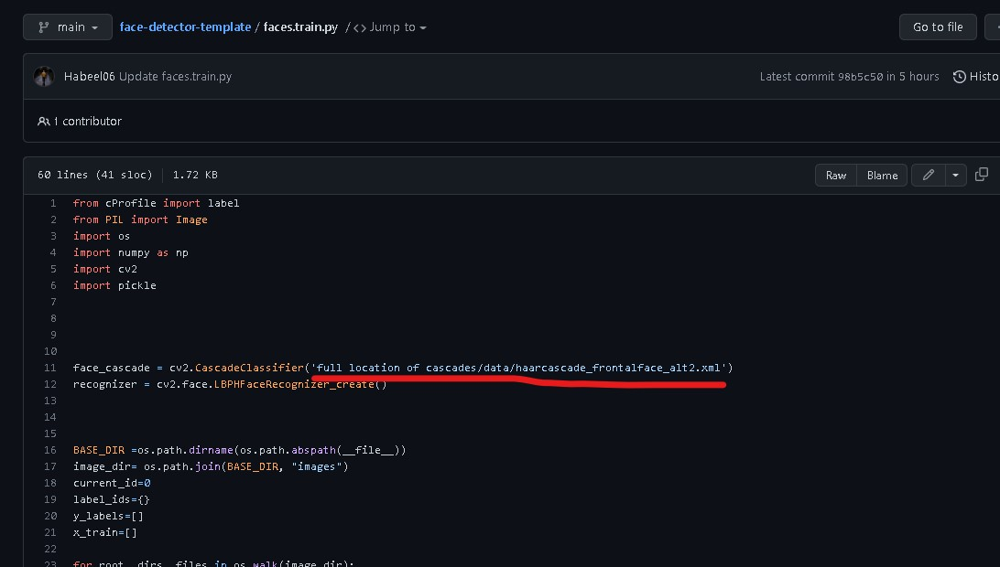
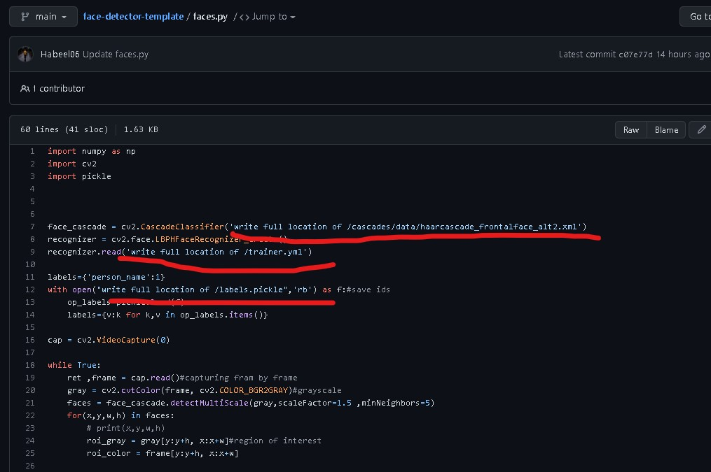

# 📝About
A face detector template using opencv.


## 👨‍💻 Dependencies
MAKE SURE THAT YOU HAVE THESE MODULES INSTALLED FIRST!
> opencv-python <br>
> opencv-contrib-python<br>
> numpy <br>
> Pillow<br>
## ✔️ How to Run
 
1️⃣Keep your images in different folders in the "images" folder on the basis of differences (for example dog pictures in one folder and cat pictures in another folder).
>Keep one thing in mind that all the images in each folder in the "images" folder will be recognized by the name of the each folder.<br>
>For example all the pictures in the "dog" folder will be recognized as "dog".

2️⃣Open ```faces.train.py``` in a code editor and paste the location of the file needed there.




3️⃣Run   ```faces.train.py``` and wait for a while untill ```trainer.yml``` and ```labels.pickle``` files are created.

 
4️⃣ Open ```faces.py``` in a code editor and paste the location of the files needed there.



5️⃣ Run the ```faces.py``` file .
 Then wait for few seconds so that camera dialog box opens, and then it will start recognizing.


## 📺 Updates
<h2>COMPLETED.</h2> 

